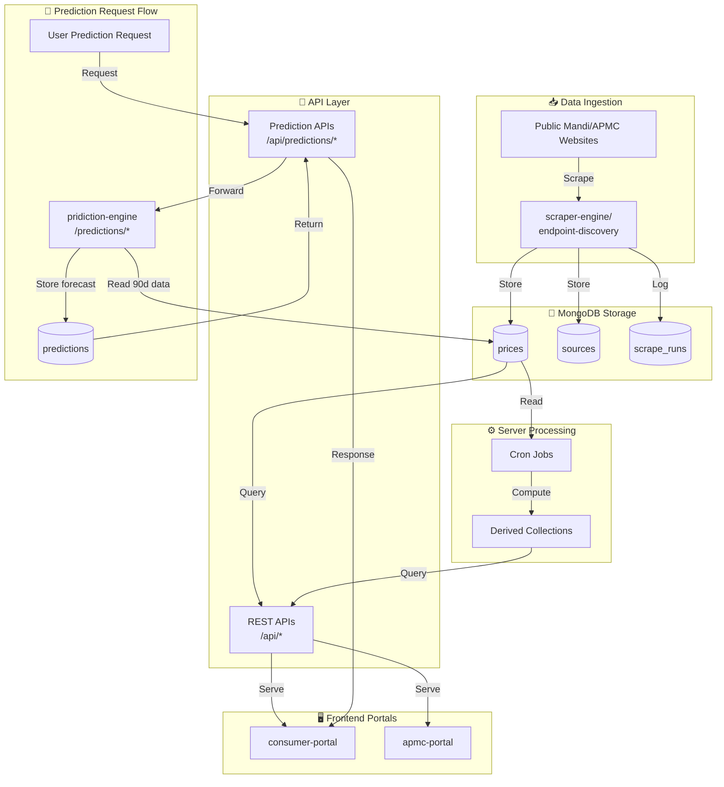
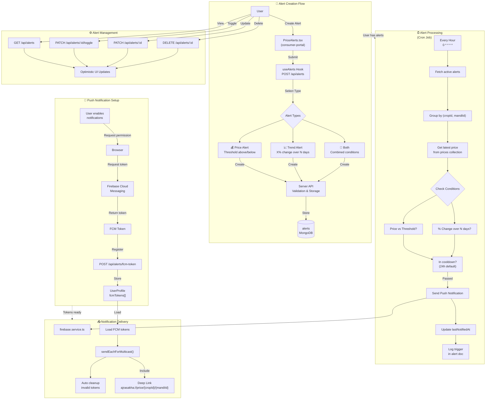

# Ajrasakha Project Workflow

This document explains the end-to-end workflow of the Ajrasakha system across ingestion, analytics, prediction, and user-facing apps.

## 1) System Overview

Ajrasakha is organized into these major services:

- `scraper-engine/endpoint-discovery`: discovers and scrapes mandi/APMC price sources.
- `server`: main API + auth + aggregation layer.
- `pridiction-engine`: forecasting microservice for crop prices.
- `consumer-portal`: end-user dashboard and insights frontend.
- `apmc-portal`: APMC/operator-facing frontend (currently largely mock-data driven).

Primary datastore: MongoDB.

## 2) End-to-End Data Flow

## 3) Ingestion Workflow (Scraper Engine)

Location: `scraper-engine/endpoint-discovery`

### Discovery Stage

- Crawls a source site using Playwright.
- Detects candidate extraction methods:
- API endpoints (from network activity)
- HTML tables
- file-based sources (PDF/XLS/XLSX)
- Uses LLM-assisted analysis to select extraction strategy.
- Saves extraction config into `sources` collection.

### Mapping Stage

- Runs a small sample scrape.
- Uses AI mapping to align source-specific field names to normalized schema.
- Saves `schemaMapping` + conversion rules for reuse.

### Scrape Stage

- Reuses saved config to extract data in bulk.
- Normalizes fields and dates.
- Writes records to `prices` (upsert-based dedupe pattern).
- Logs run details in `scrape_runs`.

### Supported Modes

- `discover`
- `scrape`
- `discover_and_scrape` (default)
- `single_url`

## 4) Backend API Workflow (Server)

Location: `server`

The Node/Express server is the central API gateway.

### Core Responsibilities

- Better Auth session/auth endpoints under `/api/auth/*`.
- Domain APIs for crops, mandis, prices, coverage, alerts, top movers, profile, admin.
- Prediction proxy/orchestration endpoints under `/api/predictions`.
- Health endpoint: `/api/health`.

### Request Lifecycle

- Frontend calls API route (cookie/session based auth where required).
- Route handlers call services.
- Services query/update MongoDB models.
- JSON response returned to frontend.

## 5) Scheduled Analytics Workflow (Cron)

Location: `server/src/jobs/cron.ts`

The backend computes derived datasets on schedule:

- `01:00 IST` daily: compute top movers and store in `TopMover`.
- `02:00 IST` daily: compute latest mandi map prices and store in `MandiPrice`.
- `Every hour`: compute coverage metrics and update `Coverage`.
- `03:00 IST` daily: remove expired prediction documents.

These precomputed collections power fast dashboard queries.

## 6) Prediction Workflow

Services involved: `server` + `pridiction-engine`

### Generation

- Client requests prediction for a `(cropId, mandiId)` pair.
- Server routes to prediction service.
- Prediction engine loads last 90 days of prices from MongoDB.
- ARIMA-based forecast generates next 7 days with confidence.
- Result is stored/upserted with 24-hour TTL semantics (`expiresAt`).

### Retrieval

- Read endpoint returns only non-expired prediction documents.
- If none exists, caller must trigger generation.

## 7) Alert Notification Workflow

Services involved: `consumer-portal` + `server` + Firebase Cloud Messaging

### Alert Types

| Type | Trigger Condition |
|------|-------------------|
| **Price Alert** | When price goes above/below threshold |
| **Trend Alert** | When price changes by X% over N days |
| **Both** | Combines both conditions |

### Cron Job Details

**Location:** `server/src/jobs/alert.processor.ts`  
**Schedule:** Every hour (`0 * * * *`)

The cron job processes alerts in batches, grouping by `(cropId, mandiId)` for efficiency.

### Notification Delivery

**Location:** `server/src/services/firebase.service.ts`

- Uses Firebase `messaging.sendEachForMulticast()` for batch delivery
- Automatically cleans up invalid/expired FCM tokens
- Payload includes deep links for mobile app navigation

## 8) Frontend Workflow

### Consumer Portal (`consumer-portal`)

- Primary user-facing app for prices, trends, alerts, map insights, analytics, and profile.
- Uses `/api` endpoints from the server (default via proxy/base URL config).
- Uses auth client (`better-auth`) with credentials/cookies.

### APMC Portal (`apmc-portal`)

- Intended for mandi/APMC operators (submission, profile, integration settings).
- Current hooks in `src/hooks/useAPMCHooks.ts` are placeholders using mock data.
- UI workflow is implemented; production API integration is still pending for several flows.

## 9) Operational Workflow (Local Dev)

Recommended startup order:

1. MongoDB
2. `server` (port `5000`)
3. `pridiction-engine` (port `8000`)
4. `consumer-portal` (port `3000`)
5. `apmc-portal` (port `8080`)
6. `scraper-engine/endpoint-discovery` (as needed for data ingestion)

## 10) Collections and Ownership

- `sources`: discovered source configurations (scraper-owned).
- `prices`: normalized historical mandi prices (scraper-owned, server-read).
- `scrape_runs`: scraper execution logs.
- `topmovers`/`top_movers`: derived movers dataset (server cron).
- `coverage`: aggregate national/state coverage stats (server cron).
- `mandiprices`/`mandi_prices`: latest map-friendly prices (server cron).
- `predictions`: generated forecasts with expiry (prediction service + server cleanup).
- `alerts`: user-configured price/trend alerts (server-owned, processed by cron).
- `userprofiles`/`user_profiles`: user data including FCM tokens for push notifications.

## 11) Current Gaps and Practical Notes

- Root `package.json` scripts are not the source of truth for all services; run commands from each service folder.
- APMC portal is not fully wired to backend APIs yet (mock hook layer still present).
- Prediction engine folder name is `pridiction-engine` in this repository.

