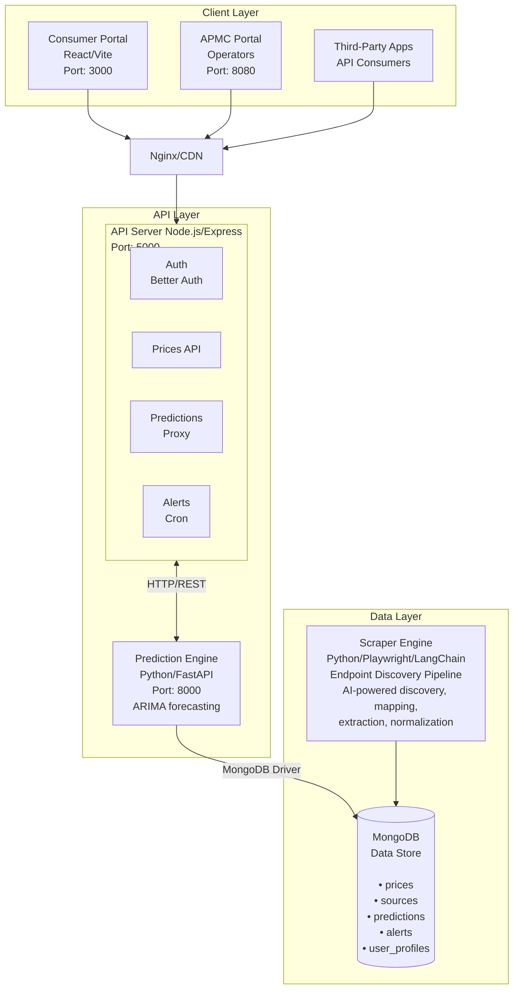
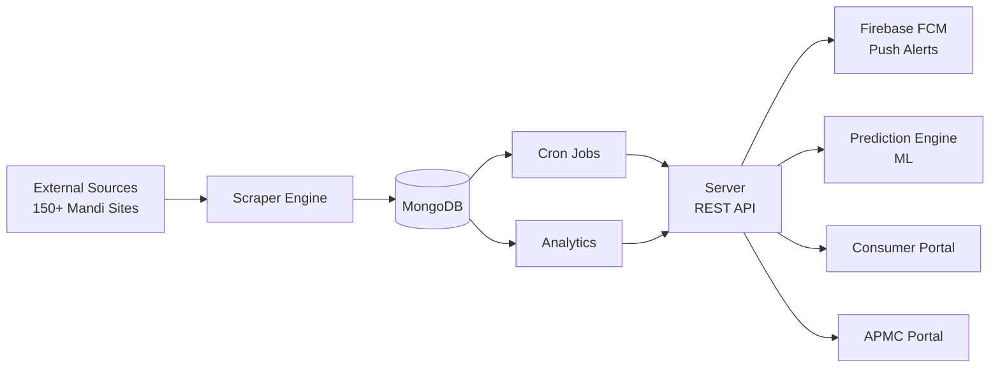

# Ajrasakha - Agricultural Market Price Analytics Platform

Problem statement: https://vicharanashala.github.io/ajrasakha-hackathon/docs/problem-statements/pb1/

Ajrasakha is a comprehensive agricultural market intelligence platform that empowers farmers, traders, and APMC operators with real-time price analytics, AI-driven forecasting, and automated alerts across Indian mandi markets.

---
**Jury Notes:**
- Check [demo.md](demo.md) for project demonstration
- The workspace is managed with pnpm and Turbo. Individual packages may still use Bun or Python entrypoints where they already exist.
- To view Mermaid diagrams in VS Code, install the [Markdown Preview Mermaid Support](https://marketplace.visualstudio.com/items?itemName=bierner.markdown-mermaid) extension, or view this file on GitHub
---

## Table of Contents

1. [Project Overview](#project-overview)
2. [System Architecture](#system-architecture)
3. [Quick Start Guide](#quick-start-guide)
4. [Prerequisites](#prerequisites)
5. [Setup Instructions](#setup-instructions)
6. [Environment Configuration](#environment-configuration)
7. [Development Workflow](#development-workflow)
8. [Troubleshooting](#troubleshooting)

---

## Project Overview

### Key Features

| Feature | Description | Module |
|---------|-------------|--------|
| **Real-time Price Tracking** | Live commodity prices from 3000+ mandis across India | Consumer Portal |
| **AI Price Forecasting** | 7-day price predictions using ARIMA models | Prediction Engine |
| **Price Alerts** | Push notifications for price thresholds and trends | Consumer Portal + Server |
| **Market Analytics** | Top movers, trend analysis, coverage maps | Consumer Portal |
| **APMC Management** | Portal for operators to manage listings and submissions | APMC Portal |
| **Data Ingestion** | AI-powered scraping from 150+ government sources | Scraper Engine |
| **Developer API** | RESTful APIs with key management for third-party access | Server |

### Target Users

- **Farmers**: Price discovery, trend analysis, alert subscriptions
- **Traders**: Market intelligence, arbitrage opportunities
- **APMC Operators**: Data submission, compliance, analytics
- **Developers**: API access for building integrations

---

## System Architecture

### High-Level Architecture



### Data Flow



---

## Quick Start Guide

Get the entire stack running locally in under 10 minutes:

```bash
# 1. Clone and navigate
git clone <repository-url>
cd Ajrasakha-Hackathon

# 2. Copy environment template
cp .env.example .env
# Edit .env with your configuration

# 3. Start MongoDB (if local)
# Using Docker:
docker run -d -p 27017:27017 --name ajrasakha-mongo mongo:7

# 4. Prepare the workspace
pnpm run setup

# 5. Start the main development stack
pnpm dev

# Access the app at http://localhost:3000
```

---

## Prerequisites

### Required Software

| Software | Version | Purpose |
|----------|---------|---------|
| Node.js | 18+ | JavaScript runtime for the workspace apps and services |
| pnpm | 10+ | Workspace package manager and Turbo runner |
| Python | 3.11+ | Prediction and scraper engines |
| MongoDB | 6.0+ | Primary database (local or Atlas) |
| Git | 2.30+ | Version control |

### Optional Software

| Software | Purpose |
|----------|---------|
| Bun | Alternative runtime for existing loader/parser utilities |
| Docker | Containerized MongoDB and deployment |
| Playwright | For scraper engine browser automation |

### System Requirements

- **RAM**: 8GB minimum (16GB recommended for full stack)
- **Storage**: 10GB free space
- **OS**: Linux/macOS/Windows with WSL2

---

## Setup Instructions

<details>
<summary><strong>1. Repository Setup</strong> (Click to expand)</summary>

```bash
# Clone repository
git clone <repository-url>
cd Ajrasakha-Hackathon

# Verify directory structure
ls -la
```
</details>

<details>
<summary><strong>2. Database Setup</strong> (Click to expand)</summary>

#### Option A: MongoDB Atlas (Cloud)
1. Create account at [MongoDB Atlas](https://www.mongodb.com/cloud/atlas)
2. Create a new cluster
3. Add your IP to Network Access
4. Create a database user
5. Copy the connection string

#### Option B: Local MongoDB
```bash
# Using Docker
docker run -d \
  --name ajrasakha-mongo \
  -p 27017:27017 \
  -e MONGO_INITDB_ROOT_USERNAME=admin \
  -e MONGO_INITDB_ROOT_PASSWORD=password \
  mongo:7

# Or install locally (Ubuntu/Debian)
sudo apt-get install mongodb
sudo systemctl start mongodb
```
</details>

<details>
<summary><strong>3. Service-by-Service Setup</strong> (Click to expand)</summary>

#### Server (Node.js/Express)

```bash
cd server

# Install dependencies
pnpm install

# Copy environment file
cp .env.example .env
# Edit .env with your MongoDB URI and auth secrets

# Start development server
pnpm --dir server run dev
```

The server will be available at `http://localhost:5000`

#### Consumer Portal (React)

```bash
cd consumer-portal

# Install dependencies
pnpm install

# Copy environment file
cp .env.example .env
# Edit .env with API URLs

# Start development server
pnpm --dir consumer-portal run dev
```

The portal will be available at `http://localhost:3000`

#### APMC Portal (React)

```bash
cd apmc-portal

# Install dependencies
pnpm install

# Start development server
pnpm --dir apmc-portal run dev
```

The portal will be available at `http://localhost:8080`

#### Prediction Engine (Python/FastAPI)

```bash
cd pridiction-engine

# Create virtual environment
pnpm --dir pridiction-engine run setup

# Start development server
pnpm --dir pridiction-engine run dev
```

The API will be available at `http://localhost:8000`

#### Scraper Engine (Python)

```bash
cd scraper-engine/endpoint-discovery

# Set up the Python environment
pnpm --dir scraper-engine/endpoint-discovery run setup

# Copy environment file
cp .env.example .env
# Edit .env with LLM API keys and MongoDB URI

# Run scraper
pnpm --dir scraper-engine/endpoint-discovery run dev
```
</details>

---

## Environment Configuration

Ajrasakha uses a **single root `.env` file** as the source of truth. All services read from this file using the `dotenv` pattern.

```bash
cp .env.example .env
```

<details>
<summary><strong>Core Server Configuration</strong> (Click to expand)</summary>

| Variable | Required | Description | Example |
|----------|----------|-------------|---------|
| `PORT` | Yes | Server port | `5000` |
| `MONGO_URI` | Yes | MongoDB connection string | `mongodb+srv://...` |
| `BETTER_AUTH_SECRET` | Yes | Min 32 char secret for auth | Generate with `openssl rand -base64 32` |
| `BETTER_AUTH_URL` | Yes | Auth service URL | `http://localhost:5000` |
| `BETTER_AUTH_TRUSTED_ORIGINS` | Yes | Allowed CORS origins | `http://localhost:5173,http://localhost:3000` |
</details>

<details>
<summary><strong>Frontend Configuration</strong> (Click to expand)</summary>

| Variable | Required | Description | Example |
|----------|----------|-------------|---------|
| `VITE_API_URL` | Yes | Consumer portal API base | `http://localhost:5000/api/consumer-portal` |
| `VITE_AUTH_BASE_URL` | Yes | Auth API endpoint | `http://localhost:5000/api/consumer-portal/auth` |
| `VITE_FIREBASE_API_KEY` | Yes* | Firebase client key | From Firebase Console |
| `VITE_FIREBASE_AUTH_DOMAIN` | Yes* | Firebase auth domain | `project.firebaseapp.com` |

*Required for push notifications
</details>

<details>
<summary><strong>Prediction Engine Configuration</strong> (Click to expand)</summary>

| Variable | Required | Description | Example |
|----------|----------|-------------|---------|
| `PREDICTION_ENGINE_PORT` | Yes | Prediction API port | `8000` |
| `PREDICTION_ENGINE_URL` | Yes | Full URL for server to call | `http://localhost:8000` |
</details>

<details>
<summary><strong>Scraper Engine Configuration</strong> (Click to expand)</summary>

| Variable | Required | Description | Example |
|----------|----------|-------------|---------|
| `DB_NAME` | Yes | MongoDB database name | `mandi_insights` |
| `LLM_PROVIDER` | Yes | `google`, `openai`, or `openrouter` | `openrouter` |
| `GOOGLE_API_KEY` | Conditional | Required if using Google provider | `AIza...` |
| `OPENAI_API_KEY` | Conditional | Required if using OpenAI | `sk-...` |
| `OPENROUTER_API_KEY` | Conditional | Required if using OpenRouter | `sk-or-...` |
| `AGENT_MODE` | Yes | `discover`, `scrape`, or `discover_and_scrape` | `discover_and_scrape` |
</details>

<details>
<summary><strong>Generating Secrets</strong> (Click to expand)</summary>

```bash
# Generate Better Auth secret
openssl rand -base64 32

# Generate Firebase service account
# Go to Firebase Console > Project Settings > Service Accounts
# Click "Generate new private key"
```
</details>

---

## Development Workflow

### Service Ports

| Service | Port | URL | Notes |
|---------|------|-----|-------|
| Server API | 5000 | http://localhost:5000 | Main backend |
| Consumer Portal | 3000 | http://localhost:3000 | End-user app |
| APMC Portal | 8080 | http://localhost:8080 | Operator portal |
| Prediction Engine | 8000 | http://localhost:8000 | ML service |
| MongoDB | 27017 | mongodb://localhost:27017 | Database |

### Running Services

Use the root-level pnpm/Turbo scripts to run services:

```bash
# Start all services at once
pnpm dev

# Or run individual services in separate terminals:

# Terminal 1: Server
pnpm --dir server run dev

# Terminal 2: Consumer Portal
pnpm --dir consumer-portal run dev

# Terminal 3: APMC Portal (optional)
pnpm --dir apmc-portal run dev

# Terminal 4: Prediction Engine
pnpm --dir pridiction-engine run dev
```

### Development Scripts

#### Server

```bash
pnpm --dir server run dev
pnpm --dir server run build
pnpm --dir server run start
pnpm --dir server run lint
pnpm --dir server run typecheck
```

#### Frontend Apps

```bash
# Consumer Portal, APMC Portal
pnpm --dir consumer-portal run dev
pnpm --dir consumer-portal run build
pnpm --dir consumer-portal run preview
pnpm --dir consumer-portal run test
pnpm --dir consumer-portal run lint
```

#### Prediction Engine

```bash
pnpm --dir pridiction-engine run setup
pnpm --dir pridiction-engine run dev
pnpm --dir pridiction-engine run start
```

#### Scraper Engine

```bash
pnpm --dir scraper-engine/endpoint-discovery run setup
pnpm --dir scraper-engine/endpoint-discovery run dev
pnpm --dir scraper-engine/endpoint-discovery run start
```

---


### Environment-Specific Configurations

| Environment | Server URL | Auth URL | Trusted Origins |
|-------------|------------|----------|-----------------|
| Development | localhost:5000 | localhost:5000 | localhost:3000,5173,8080 |
| Staging | staging-api.example.com | staging-api.example.com | staging.example.com |
| Production | api.example.com | api.example.com | app.example.com |

### Database Migrations

No formal migrations required (MongoDB is schemaless), but ensure indexes:

```javascript
// Create these indexes in MongoDB
db.prices.createIndex({ cropId: 1, mandiId: 1, date: -1 });
db.prices.createIndex({ date: -1 });
db.alerts.createIndex({ userId: 1, active: 1 });
db.predictions.createIndex({ expiresAt: 1 }, { expireAfterSeconds: 0 });
```

---

## Troubleshooting

### Common Issues

#### "VITE_API_URL environment variable is required"

**Cause**: Frontend cannot connect to backend

**Solution**:
```bash
# 1. Check .env file exists in project root
cat .env | grep VITE_API_URL

# 2. Verify server is running
curl http://localhost:5000/api/health

# 3. Restart frontend after .env changes
# (Vite requires restart to pick up env changes)
```

#### "BETTER_AUTH_SECRET is required"

**Cause**: Auth secret not configured

**Solution**:
```bash
# Generate new secret
openssl rand -base64 32

# Add to .env
BETTER_AUTH_SECRET=<generated_secret>
```

#### MongoDB Connection Failed

**Cause**: Invalid connection string or network issue

**Solution**:
```bash
# Test connection
mongosh "<your_connection_string>"

# For Atlas: whitelist your IP
# For local: ensure MongoDB service is running
sudo systemctl status mongodb  # Linux
```

#### Prediction Engine 500 Error

**Cause**: Insufficient historical data for ARIMA

**Solution**:
- Ensure prices collection has data for the requested crop/mandi
- Check prediction engine logs for detailed error

#### Scraper Engine Not Discovering Sources

**Cause**: LLM API key invalid or rate limited

**Solution**:
```bash
# Verify API key
curl -H "Authorization: Bearer $GOOGLE_API_KEY" \
  https://generativelanguage.googleapis.com/v1beta/models

# Check rate limits in provider dashboard
```

#### CORS Errors in Browser

**Cause**: Origin not in trusted origins list

**Solution**:
```bash
# Update .env with correct origins
BETTER_AUTH_TRUSTED_ORIGINS=http://localhost:3000,http://localhost:8080,http://localhost:5173

# Restart server
```

#### Push Notifications Not Working

**Cause**: Firebase not configured correctly

**Solution**:
1. Verify Firebase project settings
2. Check VAPID key is set in environment
3. Ensure service account JSON is valid
4. Check browser console for permission errors

### Debug Commands

```bash
# Check all services status
curl http://localhost:5000/api/health
curl http://localhost:8000/health

# View MongoDB collections
mongosh "<uri>" --eval "show collections"

# Check recent logs
cd server && tail -f server.log

# Verify environment variables
cat .env | grep -v "^#" | grep -v "^$"
```

### Getting Help

1. Check [PROJECT_WORKFLOW.md](./PROJECT_WORKFLOW.md) for detailed workflow documentation
2. Review environment configuration in [AGENTS.md](./AGENTS.md)
3. Check service-specific logs in each directory
4. File issues with reproduction steps

---

## Repository Structure

```
Ajrasakha-Hackathon/
├── server/                    # Node.js/Express API
│   ├── src/
│   │   ├── routes/           # API route handlers
│   │   ├── models/           # Mongoose schemas
│   │   ├── services/         # Business logic
│   │   ├── jobs/             # Cron jobs and processors
│   │   └── middleware/       # Auth and validation
│   └── package.json
│
├── consumer-portal/           # React frontend (end users)
│   ├── src/
│   │   ├── pages/            # Route components
│   │   ├── components/       # Reusable UI
│   │   ├── hooks/            # TanStack Query hooks
│   │   └── lib/              # Utilities and API client
│   └── package.json
│
├── apmc-portal/              # React frontend (operators)
│   └── src/
│
├── pridiction-engine/        # Python FastAPI ML service
│   ├── app/
│   │   ├── main.py           # FastAPI app
│   │   └── services/         # Prediction logic
│   └── requirements.txt
│
├── scraper-engine/           # Data ingestion pipeline
│   ├── endpoint-discovery/   # AI-powered source discovery
│   ├── loader/               # Data loading utilities
│   ├── parser/               # HTML/PDF parsers
│   └── mapper/               # Field mapping logic
│
├── seeder/                   # Database seeding scripts
├── shared/                   # Shared TypeScript types
├── docs/                     # Additional documentation
├── .env.example              # Environment template
├── PROJECT_WORKFLOW.md       # Detailed workflow docs
└── README.md                 # This file
```

---

## Tech Stack

### Frontend
- **Framework**: React 18 with TypeScript
- **Build Tool**: Vite
- **State Management**: TanStack Query (React Query)
- **Styling**: Tailwind CSS
- **UI Components**: shadcn/ui
- **Authentication**: Better Auth

### Backend
- **Runtime**: Node.js 18+
- **Framework**: Express.js with TypeScript
- **Database**: MongoDB with Mongoose ODM
- **Authentication**: Better Auth (session-based)
- **Validation**: Zod
- **Cron Jobs**: node-cron

### Data/ML
- **API Framework**: Python FastAPI
- **ML Libraries**: pandas, statsmodels (ARIMA)
- **Data Processing**: numpy, scipy
- **Browser Automation**: Playwright
- **LLM Integration**: LangChain

### Infrastructure
- **Database**: MongoDB (Atlas or self-hosted)
- **Push Notifications**: Firebase Cloud Messaging
- **Package Manager**: pnpm/Turbo (Node.js), pip (Python)
- **Version Control**: Git

---

## License

MIT License - see [LICENSE](./LICENSE) for details.

---

## Contributing

1. Fork the repository
2. Create a feature branch: `git checkout -b feature/amazing-feature`
3. Commit changes: `git commit -m 'Add amazing feature'`
4. Push to branch: `git push origin feature/amazing-feature`
5. Open a Pull Request

---

<p align="center">
  <strong>Ajrasakha</strong> - Empowering Indian agriculture with data intelligence
</p>
