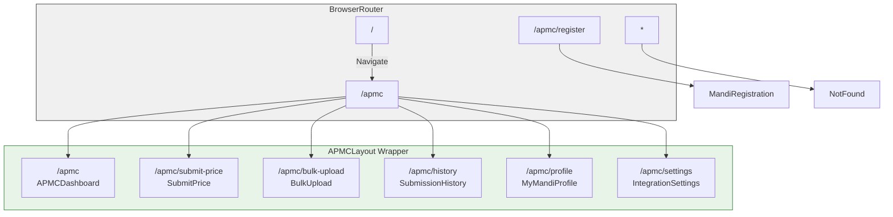
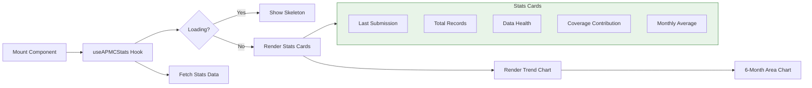
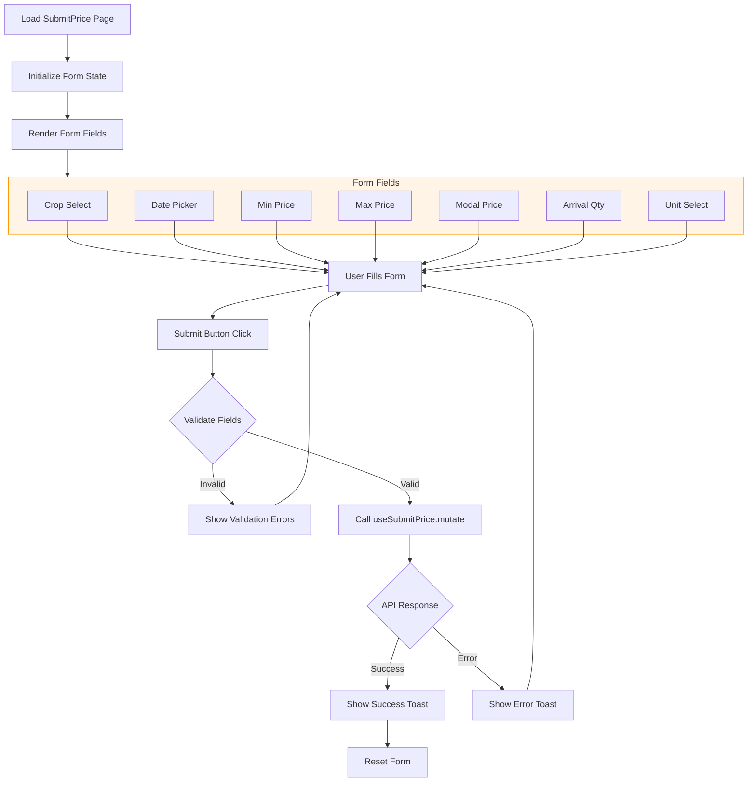
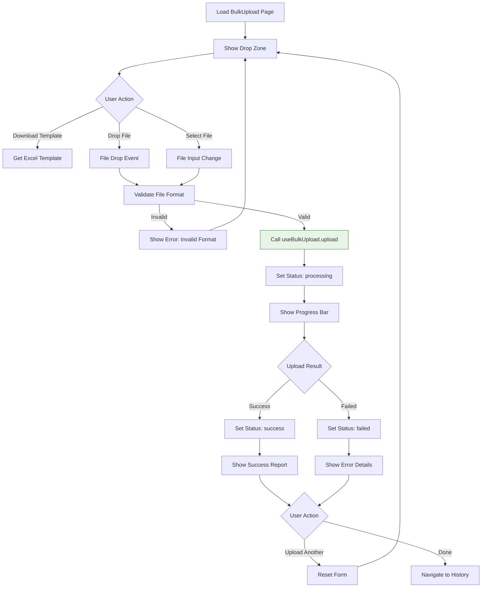
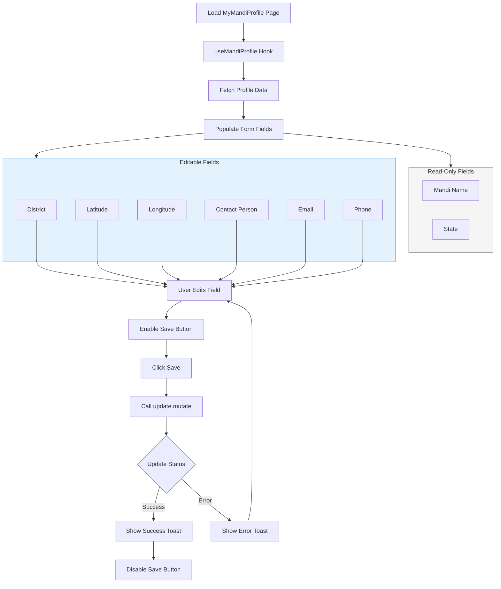
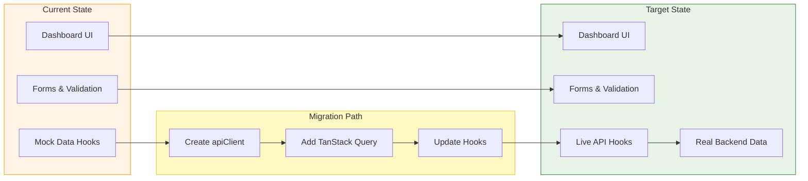

# APMC Portal - Workflow Documentation

React-based frontend portal for APMC (Agricultural Produce Market Committee) operators to submit price data, manage their mandi profile, and configure integration settings.

---

## 1. Architecture Overview

### Tech Stack

| Technology | Version | Purpose |
|------------|---------|---------|
| React | 18.3.1 | UI framework |
| Vite | 5.4.x | Build tool & dev server |
| TypeScript | 5.8.x | Type safety |
| TanStack Query | 5.83.x | Server state management |
| Tailwind CSS | 3.4.x | Utility-first styling |
| shadcn/ui | latest | Component library |
| Recharts | 2.15.x | Data visualization |
| React Router | 6.30.x | Client-side routing |

### Project Structure

```
apmc-portal/
├── src/
│   ├── components/
│   │   ├── ui/                    # shadcn/ui components (50+ components)
│   │   ├── apmc/
│   │   │   ├── APMCLayout.tsx     # Main layout wrapper
│   │   │   ├── APMCSidebar.tsx    # Navigation sidebar
│   │   │   ├── APMCTopbar.tsx     # Header with mobile menu
│   │   │   ├── StatCard.tsx       # Dashboard stat component
│   │   │   └── StatusBadge.tsx    # Status indicator component
│   │   └── NavLink.tsx
│   ├── pages/
│   │   ├── apmc/
│   │   │   ├── APMCDashboard.tsx      # Overview & stats
│   │   │   ├── SubmitPrice.tsx        # Single price entry form
│   │   │   ├── BulkUpload.tsx         # Excel/CSV upload
│   │   │   ├── SubmissionHistory.tsx  # Past submissions table
│   │   │   ├── MyMandiProfile.tsx     # Profile management
│   │   │   ├── IntegrationSettings.tsx # API config
│   │   │   └── MandiRegistration.tsx  # New mandi signup
│   │   ├── Index.tsx
│   │   └── NotFound.tsx
│   ├── hooks/
│   │   ├── useAPMCHooks.ts        # Mock data hooks (TO BE REPLACED)
│   │   ├── use-toast.ts
│   │   └── use-mobile.tsx
│   ├── lib/
│   │   ├── routes.ts              # Route definitions
│   │   └── utils.ts               # Utility functions
│   ├── config/
│   │   └── firebase.ts
│   ├── test/
│   │   └── setup.ts
│   ├── main.tsx
│   ├── App.tsx
│   ├── index.css                  # Global styles + CSS variables
│   └── vite-env.d.ts
├── tailwind.config.ts
├── vite.config.ts
└── package.json
```

### Routing Setup



Routes are defined in `src/lib/routes.ts` and configured in `src/App.tsx`.

---

## 2. Page Workflows

### Dashboard (`/apmc`)

**Purpose**: APMC-specific overview showing key metrics and submission trends.



**Features**:
- Stats cards: Last Submission, Total Records, Data Health, Coverage Contribution, Monthly Avg
- Area chart showing 6-month submission trend
- Real-time data health indicators

**Hook**: `useAPMCStats()`

---

### Submit Price (`/apmc/submit-price`)

**Purpose**: Manual entry form for daily commodity price data.



**Form Fields**:
| Field | Type | Required | Validation |
|-------|------|----------|------------|
| Crop | Select | Yes | Must select from list |
| Date | Date picker | Yes | Calendar selection |
| Min Price | Number | Yes | Cannot exceed max price |
| Max Price | Number | Yes | Must be >= min price |
| Modal Price | Number | Yes | Within min-max range |
| Arrival Quantity | Number | No | Optional |
| Unit | Select | No | Quintal/Tonne/Kg |

**Hook**: `useSubmitPrice()`

---

### Bulk Upload (`/apmc/bulk-upload`)

**Purpose**: Upload price data via Excel/CSV files.



**Features**:
- Drag-and-drop file zone
- File validation (CSV, XLSX, XLS)
- Progress tracking
- Processing status indicators
- Template download button

**Hook**: `useBulkUpload()`

**Features**:
- Drag-and-drop file zone
- File validation (CSV, XLSX, XLS)
- Progress tracking
- Processing status indicators
- Template download button

**Hook**: `useBulkUpload()`

---

### Submission History (`/apmc/history`)

**Purpose**: View and filter past price submissions.

**Features**:
- Search by crop name or date
- Crop filter dropdown
- Paginated table view
- Columns: Date, Crop, Min/Max/Modal Price, Source

**Hook**: `useSubmissionHistory()`

```typescript
const { data: records, totalPages, currentPage } = useSubmissionHistory();
// Record: { id, date, crop, minPrice, maxPrice, modalPrice, status, source }
```

---

### My Mandi Profile (`/apmc/profile`)

**Purpose**: Manage APMC mandi profile information.



**Editable Fields**:
- District
- Latitude / Longitude
- Contact Person
- Email
- Phone

**Read-only Fields**:
- Mandi Name
- State

**Hook**: `useMandiProfile()`

---

### Integration Settings (`/apmc/settings`)

**Purpose**: Configure data source and API credentials.

**Features**:
- Data source type selector (Manual / Excel / API)
- API key display with copy button
- Webhook URL display
- API key regeneration
- Last verified timestamp

**Hook**: `useIntegrationSettings()`

```typescript
const { data: settings, updateSource, regenerateKey } = useIntegrationSettings();
// settings: { dataSourceType, apiKey, webhookUrl, integrationStatus, lastVerified }
```

---

### Mandi Registration (`/apmc/register`)

**Purpose**: Standalone registration page for new APMC markets.

**Form Sections**:
1. **Mandi Details**: Name, State, District, Code, Lat/Long
2. **Contact Info**: Person, Designation, Email, Phone
3. **Integration Preference**: Data source type, Remarks

**Validation**:
- All fields marked with * are required
- Email must match regex: `/^[^\s@]+@[^\s@]+\.[^\s@]+$/`
- Phone must match: `/^[+]?[\d\s-]{10,15}$/`

---

## 3. Current Implementation Status



### Implemented Features

| Feature | Status | Notes |
|---------|--------|-------|
| Dashboard UI | ✅ Complete | With stat cards and trend chart |
| Submit Price Form | ✅ Complete | Full validation implemented |
| Bulk Upload UI | ✅ Complete | Drag-drop, progress simulation |
| Submission History | ✅ Complete | Search, filter, pagination |
| Profile Management | ✅ Complete | Form with editable fields |
| Integration Settings | ✅ Complete | Source selector, API display |
| Mandi Registration | ✅ Complete | Standalone registration page |
| Sidebar Navigation | ✅ Complete | Mobile responsive |
| Responsive Design | ✅ Complete | Mobile-first approach |

### Placeholder / Mock Data

**All data fetching hooks currently use mock data**:

| Hook | Mock Data | API Integration Needed |
|------|-----------|----------------------|
| `useAPMCStats()` | Hardcoded stats object | ✅ Yes |
| `useSubmitPrice()` | Console.log only | ✅ Yes |
| `useBulkUpload()` | Simulated progress | ✅ Yes |
| `useSubmissionHistory()` | Hardcoded array of 8 records | ✅ Yes |
| `useMandiProfile()` | Static profile object | ✅ Yes |
| `useIntegrationSettings()` | Static settings object | ✅ Yes |

**File to replace**: `src/hooks/useAPMCHooks.ts`

---

## 4. Data Fetching Patterns

### Current Pattern (Mock)

```typescript
// src/hooks/useAPMCHooks.ts
export function useAPMCStats() {
  return {
    data: { /* mock data */ },
    isLoading: false,
  };
}
```

### Target Pattern (TanStack Query)

```typescript
import { useQuery, useMutation } from "@tanstack/react-query";
import { apiClient } from "@/lib/api";

export function useAPMCStats() {
  return useQuery({
    queryKey: ["apmc", "stats"],
    queryFn: () => apiClient.get("/apmc/stats"),
  });
}

export function useSubmitPrice() {
  return useMutation({
    mutationFn: (data: PriceSubmission) => 
      apiClient.post("/apmc/prices", data),
    onSuccess: () => {
      queryClient.invalidateQueries({ queryKey: ["apmc", "stats"] });
    },
  });
}
```

### API Client Setup (To Be Implemented)

Create `src/lib/api.ts`:

```typescript
const apiUrl = import.meta.env.VITE_API_URL;
if (!apiUrl) {
  throw new Error('VITE_API_URL environment variable is required');
}

export const apiClient = {
  get: (path: string) => fetch(`${apiUrl}${path}`).then(r => r.json()),
  post: (path: string, data: unknown) => 
    fetch(`${apiUrl}${path}`, {
      method: "POST",
      headers: { "Content-Type": "application/json" },
      body: JSON.stringify(data),
    }).then(r => r.json()),
};
```

---

## 5. APMC-Specific Features

### Price Submission Workflows

```mermaid
flowchart TD
    subgraph SingleEntry["Single Entry Flow"]
        SE1[User Accesses] --> SE2[Submit Price Page]
        SE2 --> SE3[Fill Price Form]
        SE3 --> SE4[Client Validation]
        SE4 -->|Invalid| SE5[Show Field Errors]
        SE5 --> SE3
        SE4 -->|Valid| SE6[POST /api/apmc/prices]
        SE6 --> SE7{API Response}
        SE7 -->|201 Created| SE8[Show Success Toast]
        SE7 -->|Error| SE9[Show Error Message]
        SE9 --> SE3
        SE8 --> SE10[Clear Form]
    end

    subgraph BulkUpload["Bulk Upload Flow"]
        BU1[User Accesses] --> BU2[Bulk Upload Page]
        BU2 --> BU3[Download Template]
        BU3 --> BU4[Fill Excel/CSV]
        BU4 --> BU5[Drop File]
        BU5 --> BU6[Validate Format]
        BU6 -->|Invalid| BU7[Show Format Error]
        BU7 --> BU5
        BU6 -->|Valid| BU8[POST /api/apmc/prices/bulk]
        BU8 --> BU9[Show Progress]
        BU9 --> BU10{Process Result}
        BU10 -->|Success| BU11[Show Success Report]
        BU10 -->|Partial| BU12[Show Error Report]
        BU10 -->|Failed| BU13[Show Failure Message]
    end

    subgraph APISource["API Integration Flow"]
        API1[External System] --> API2[POST to Webhook]
        API2 --> API3[Validate API Key]
        API3 -->|Invalid| API4[401 Unauthorized]
        API3 -->|Valid| API5[Process Payload]
        API5 --> API6[Store Prices]
        API6 --> API7[200 OK Response]
    end

    style SingleEntry fill:#e8f4e8,stroke:#2e7d32
    style BulkUpload fill:#fff4e6,stroke:#ff9800
    style APISource fill:#e3f2fd,stroke:#2196f3
```



**Data Sources Supported**:
1. **Manual** - Form-based entry (Single Entry Flow)
2. **Excel** - CSV/XLSX file upload (Bulk Upload Flow)
3. **API** - Direct system integration via REST API (API Integration Flow)

### Profile Management

**Immutable Fields** (set at registration):
- Mandi Name
- State

**Editable Fields**:
- Contact information
- Geographic coordinates
- District

### Integration Settings

**API Integration Features**:
- Auto-generated API key (masked display)
- Webhook URL for receiving updates
- Key regeneration capability
- Integration status tracking (Pending/Approved/Rejected)

---

## 6. Component Patterns

### shadcn/ui Usage

Components are imported from `@/components/ui/`:

```typescript
import { Button } from "@/components/ui/button";
import { Card, CardContent, CardHeader, CardTitle } from "@/components/ui/card";
import { Input } from "@/components/ui/input";
import { Select, SelectContent, SelectItem, SelectTrigger, SelectValue } from "@/components/ui/select";
import { Table, TableBody, TableCell, TableHead, TableHeader, TableRow } from "@/components/ui/table";
```

### APMC Custom Components

**StatCard** (`src/components/apmc/StatCard.tsx`):
```typescript
interface StatCardProps {
  title: string;
  value: string | number;
  icon: LucideIcon;
  description?: string;
  accentColor?: "primary" | "secondary" | "accent" | "success" | "warning" | "info";
}
```

**StatusBadge** (`src/components/apmc/StatusBadge.tsx`):
```typescript
interface StatusBadgeProps {
  status: string;  // Active, Pending, Approved, Rejected, etc.
  className?: string;
}
```

### Form Patterns

Using uncontrolled forms with FormData:

```typescript
const handleSubmit = (e: React.FormEvent<HTMLFormElement>) => {
  e.preventDefault();
  const formData = new FormData(e.currentTarget);
  const crop = formData.get("crop") as string;
  // ... validation and submission
};
```

---

## 7. Future Integration Points

### Required API Endpoints

| Endpoint | Method | Purpose |
|----------|--------|---------|
| `/api/apmc/stats` | GET | Dashboard statistics |
| `/api/apmc/prices` | POST | Submit single price |
| `/api/apmc/prices/bulk` | POST | Bulk upload prices |
| `/api/apmc/prices` | GET | Submission history |
| `/api/apmc/profile` | GET/PUT | Profile management |
| `/api/apmc/integration` | GET/PUT | Settings management |
| `/api/apmc/register` | POST | New mandi registration |

### Planned Features

1. **Authentication Integration**
   - Login/logout flow
   - Session management
   - Role-based access

2. **Real-time Notifications**
   - WebSocket connection for live updates
   - Toast notifications for submission status

3. **Advanced Analytics**
   - Price trend analysis
   - Market comparison charts
   - Export reports (PDF/Excel)

4. **Multi-language Support**
   - Hindi/Regional language support
   - i18n implementation

---

## 8. Development Workflow

### Adding New Pages

1. Create page component in `src/pages/apmc/NewPage.tsx`
2. Add route constant in `src/lib/routes.ts`
3. Add route in `src/App.tsx` within `APMCLayout` wrapper
4. Add nav item in `src/components/apmc/APMCSidebar.tsx`
5. Create hook in `src/hooks/useAPMCHooks.ts` (mock first)

### Replacing Mock Data with Real APIs

**Step 1**: Create API client
```typescript
// src/lib/api.ts
export const apiClient = { /* ... */ };
```

**Step 2**: Update hook to use TanStack Query
```typescript
// Replace mock implementation
export function useAPMCStats() {
  return useQuery({
    queryKey: ["apmc", "stats"],
    queryFn: () => apiClient.get("/apmc/stats"),
  });
}
```

**Step 3**: Handle loading/error states in components
```typescript
const { data, isLoading, error } = useAPMCStats();
if (isLoading) return <Skeleton />;
if (error) return <ErrorMessage />;
```

### Testing Approach

**Unit Tests**: Vitest + React Testing Library
```typescript
// src/test/example.test.ts
import { render, screen } from "@testing-library/react";
import { describe, it, expect } from "vitest";

describe("Component", () => {
  it("renders correctly", () => {
    render(<Component />);
    expect(screen.getByText("Title")).toBeInTheDocument();
  });
});
```

**Run Tests**:
```bash
bun test              # Run once
bun test --watch      # Watch mode
```

**Lint & Type Check**:
```bash
bun run lint          # ESLint
bun run tsc --noEmit  # TypeScript check
```

### Environment Variables

Create `.env` in project root:

```env
# API Configuration
VITE_API_URL=http://localhost:5000/api/apmc

# Optional: Auth base URL
VITE_AUTH_BASE_URL=http://localhost:5000/api
```

---

## Quick Reference

### Running the Project

```bash
bun install      # Install dependencies
bun run dev      # Start dev server (port 8080)
bun run build    # Production build
bun run preview  # Preview production build
```

### Key Files for Common Tasks

| Task | File |
|------|------|
| Add new route | `src/lib/routes.ts`, `src/App.tsx` |
| Update sidebar nav | `src/components/apmc/APMCSidebar.tsx` |
| Add mock data hook | `src/hooks/useAPMCHooks.ts` |
| Global styles | `src/index.css` |
| Theme colors | `tailwind.config.ts` |

### Color Palette (CSS Variables)

| Name | Light | Dark | Usage |
|------|-------|------|-------|
| `--primary` | Green | Green | Buttons, links |
| `--secondary` | Gold | Gold | Accents |
| `--accent` | Orange | Orange | Highlights |
| `--success` | Green | Green | Success states |
| `--warning` | Yellow | Yellow | Warnings |
| `--info` | Blue | Blue | Information |
| `--destructive` | Red | Red | Errors |
| `--sidebar-background` | Dark green | Dark | Sidebar bg |

---

*Last updated: March 2026*
