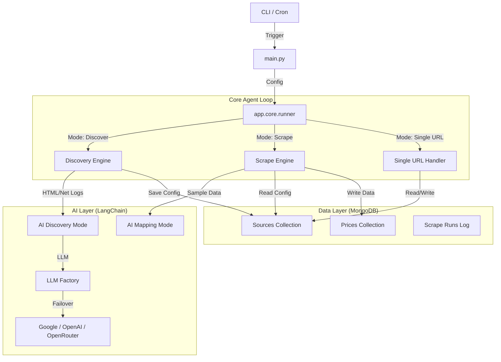
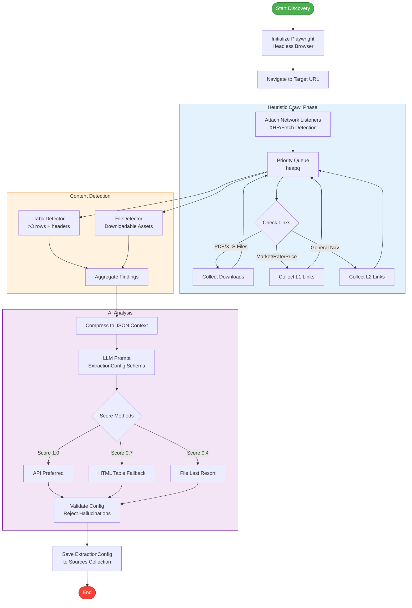
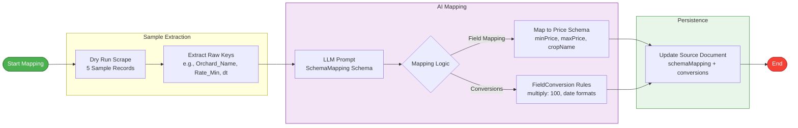
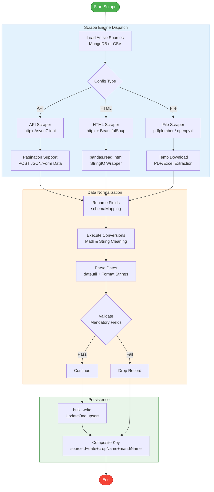
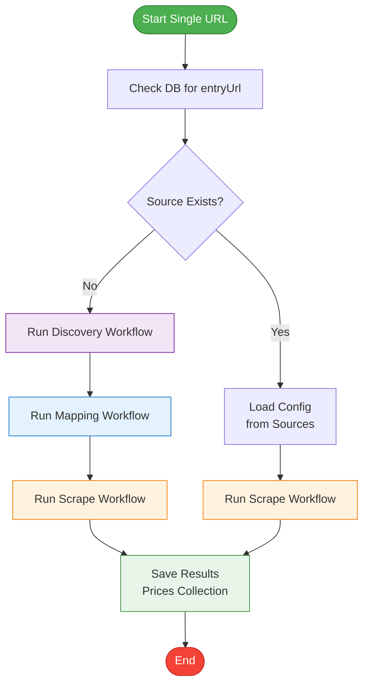

# Mandi AI Agent — Workflow & Architecture

This document serves as the definitive technical guide for the Mandi Scraper Agent. The system is designed to autonomously discover, map, and scrape agricultural market price data from disparate government portals using a resilient, multi-stage pipeline powered by LLMs and asynchronous I/O.

## 1. High-Level Architecture

The agent operates as a modular CLI tool with distinct layers for orchestration, discovery, scraping, and AI analysis.



## 2. Detailed Workflows

### A. Discovery Workflow (`mode="discover"`)
*Goal: Find out HOW to scrape a new website without human coding.*



### B. Mapping Workflow (Implicit in Discovery/First Scrape)
*Goal: Semantic understanding of column names.*



### C. Scrape Workflow (`mode="scrape"`)
*Goal: High-volume production extraction.*



### D. Single URL Workflow (`mode="single_url" --url ...`)
*Goal: One-shot onboarding.*



## 3. Configuration & Environment

The agent uses a frozen `AppConfig` dataclass populated by `.env` and CLI args.

| Variable | Description | Default |
|----------|-------------|---------|
| `MONGO_URI` | MongoDB Connection String | — |
| `DB_NAME` | Database Name | `mandi_insights` |
| `LLM_PROVIDER` | `google`, `openai`, `openrouter` | `google` |
| `GOOGLE_API_KEY` | For Gemini models | — |
| `OPENROUTER_API_KEY` | For OpenRouter | — |
| `OPENROUTER_MODEL` | Comma-separated model list for failover | `google/gemini-2.0-flash-001` |
| `HEADLESS` | Run browser without UI | `true` |

## 4. Resilience & Error Handling

### LLM Robustness
*   **Failover Chain**: When using `OPENROUTER`, you can provide a list of models (e.g., `mistral-7b,gemini-2.0,phi-3`). The factory creates a `RunnableWithFallbacks` that automatically retries with the next model upon failure (429, 404, 500).
*   **Structured Output Fallback**: Many free models do not support OpenAI's "JSON Mode" or "Tool Calling". The agent implements a custom parser that:
    1.  Injects a strict JSON schema instruction into the user prompt.
    2.  Uses Regex to strip Markdown fences (` ```json ... ``` `) and "thinking" blocks (`<think>...`).
    3.  Validates the raw string using Pydantic `model_validate_json`.

### Scraping Robustness
*   **HTML Parsing**: `pandas.read_html` can crash on large strings if interpreted as filenames. The agent wraps content in `io.StringIO`.
*   **Hallucination Guard**: Pydantic validators reject AI-generated CSS selectors that contain HTML tags (e.g., `<div...`).
*   **Async/Await**: All network I/O (DB, HTTP, Playwright) is asynchronous to maximize throughput.

### Database Health
*   **Connection Check**: Gracefully degrades to text logging if MongoDB is unreachable.
*   **Health Monitoring**: Tracks consecutive failures. Sources are marked `BROKEN` after 3 failed runs, preventing wasted resources.

## 5. File System Structure

*   **`main.py`**: Entry point & DI container.
*   **`config.py`**: Configuration logic.
*   **`app/core/`**:
    *   `runner.py`: Main control loop.
    *   `context.py`: Request-scoped context (logger, stats).
*   **`app/discovery/`**:
    *   `crawler.py`: Playwright logic.
    *   `network_sniffer.py`: API detection.
*   **`app/scraping/`**:
    *   `scrape_engine.py`: Dispatcher.
    *   `html_scraper.py`, `api_scraper.py`: Implementations.
*   **`app/ai/`**:
    *   `llm.py`: Factory & Failover logic.
    *   `prompts.py`: Prompt templates.
*   **`app/inputs/`**, **`app/outputs/`**: I/O Adapters.

## 6. Usage Examples

**Production Run** (Cron Job)
```bash
# Runs scraping for all active sources in DB
python3 main.py --mode scrape --log mongo
```

**Onboard New Source**
```bash
# Auto-discovers config, maps schema, scrapes data, and saves to DB
python3 main.py --url https://www.apmcnagpur.com/
```

**Debug Mode** (No DB writes)
```bash
# Writes outputs to local CSV/JSON files
python3 main.py --input csv --log txt --url https://example.com
```
