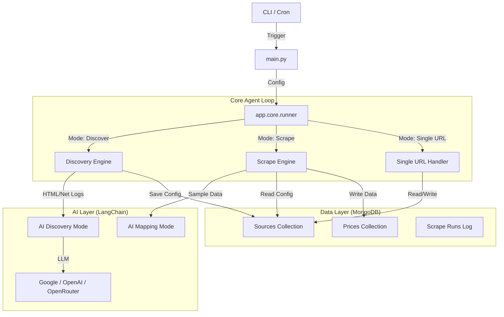

# Mandi AI Agent — Workflow & Architecture

This document details the internal operation of the AI-powered Mandi Scraper Agent. The system is designed to autonomously discover, map, and scrape agricultural market price data from disparate government portals using a resilient, multi-stage pipeline.

## 1. High-Level Architecture

The agent operates as a CLI tool with a modular architecture:



## 2. Key Workflows

### A. Discovery Workflow (`mode="discover"`)
*Goal: Find out HOW to scrape a new website without human coding.*

1.  **Crawl & Sniff**:
    *   **Crawler**: Uses `Playwright` to visit the target URL and click links (depth-limited BFS).
    *   **Network Sniffer**: Captures all background XHR/Fetch requests to find hidden APIs.
    *   **Table/File Detector**: Scans HTML for `<table>` tags and links to PDF/Excel files.
2.  **AI Analysis**:
    *   Aggregates all findings (API endpoints, table selectors, file URLs) into a JSON context.
    *   Sends this context to the LLM (Gemini/GPT/Mistral) with `ExtractionConfig` schema.
    *   **Decision**: The AI selects the *best* method (API > HTML Table > File) and returns a configuration (e.g., `extractionType="api"`, `endpoint="..."`).
3.  **Persistence**:
    *   Saves the discovered configuration to the `sources` collection in MongoDB.

### B. Mapping Workflow (Implicit in Discovery/First Scrape)
*Goal: Understand the column names of a new source.*

1.  **Sample Scrape**: Runs the discovered extraction config to fetch the first 5 records.
2.  **AI Mapping**:
    *   Sends the raw field names (e.g., `Orchard_Name`, `Rate_Min`) to the LLM.
    *   LLM maps them to the unified schema (e.g., `cropName`, `minPrice`) using `SchemaMapping` schema.
    *   Generates conversion rules (e.g., "Multiply by 100 to convert kg to quintal").
3.  **Persistence**:
    *   Saves `schemaMapping` and `conversions` to the `sources` collection.

### C. Scrape Workflow (`mode="scrape"`)
*Goal: Extract production data using saved configs.*

1.  **Load Sources**: Fetches all enabled sources from MongoDB.
2.  **Dispatch**:
    *   **API Scraper**: Uses `httpx` to call endpoints (supports pagination, POST/GET).
    *   **HTML Scraper**: Uses `httpx` + `pandas` + `BeautifulSoup` to parse tables.
    *   **File Scraper**: Uses `pdfplumber` (PDF) or `openpyxl` (Excel) to extract tables.
3.  **Normalize**:
    *   Applies the saved `schemaMapping` to rename fields.
    *   Applies `conversions` (math operations, date parsing).
    *   Validates data types (prices must be numbers, dates must be ISO).
4.  **Save**:
    *   Upserts records into `prices` collection (deduplicated by `sourceId` + `date` + `crop` + `mandi`).
    *   Updates `scrape_runs` log and source health status.

### D. Single URL Workflow (`mode="single_url" --url ...`)
*Goal: One-shot onboarding of a new site.*

1.  **Check DB**: Does a config exist for this URL?
2.  **If No**: Run **Discovery Workflow** immediately.
3.  **Then**: Run **Scrape Workflow** using the (existing or just-discovered) config.

## 3. Data Structures

### Source Config (MongoDB `sources`)
```json
{
  "_id": "...",
  "entryUrl": "https://www.apmcnagpur.com/",
  "extractionType": "html_table",
  "htmlSelector": "table.txt_blc",
  "schemaMapping": {
    "Agril Produce": "cropName",
    "Rate": "modalPrice"
  },
  "status": "active",
  "health": "ok"
}
```

### Price Record (MongoDB `prices`)
Matches `shared/types/index.ts`:
```json
{
  "sourceId": "...",
  "cropName": "Wheat",
  "mandiName": "Nagpur",
  "minPrice": 2200,
  "maxPrice": 2400,
  "modalPrice": 2300,
  "date": "2025-02-14T00:00:00Z",
  "unit": "Quintal",
  "currency": "INR"
}
```

## 4. Resilience & Error Handling

*   **LLM Failover**:
    *   If using **OpenRouter**, the agent supports a list of models (e.g., Mistral → Gemini → Phi).
    *   If one fails (429 Rate Limit, 404 Not Found), it automatically retries with the next.
    *   **Structured Output Fallback**: For models that don't support JSON mode, the agent uses a robust prompt injection + Regex parser to extract valid JSON.
*   **HTML Parsing**:
    *   Uses `io.StringIO` to prevent Pandas from misinterpreting large HTML chunks as filenames.
    *   Validates AI-generated selectors to prevent hallucinations (e.g., rejecting selectors that look like HTML tags).
*   **Database**:
    *   Gracefully degrades to CSV logging/output if MongoDB connection fails.
    *   Uses `asyncio` for non-blocking database writes.

## 5. File System Structure

*   `main.py`: Entry point.
*   `config.py`: Configuration & CLI parsing.
*   `app/core/runner.py`: Main orchestration logic.
*   `app/discovery/`: Playwright crawler & detection logic.
*   `app/scraping/`: Actual scraping implementations (API/HTML/File).
*   `app/ai/`: LLM interaction, prompts, and structured output handling.
*   `app/inputs/` & `app/outputs/`: Adapters for MongoDB vs CSV.

## 6. How to Run

**1. Standard Production Run (Daily)**
```bash
python3 main.py --mode scrape --log mongo
```

**2. Onboard a New Source**
```bash
python3 main.py --url https://new-mandi-site.com/
```

**3. Debug/Test Offline**
```bash
python3 main.py --input csv --log txt --url https://test-site.com/
```
