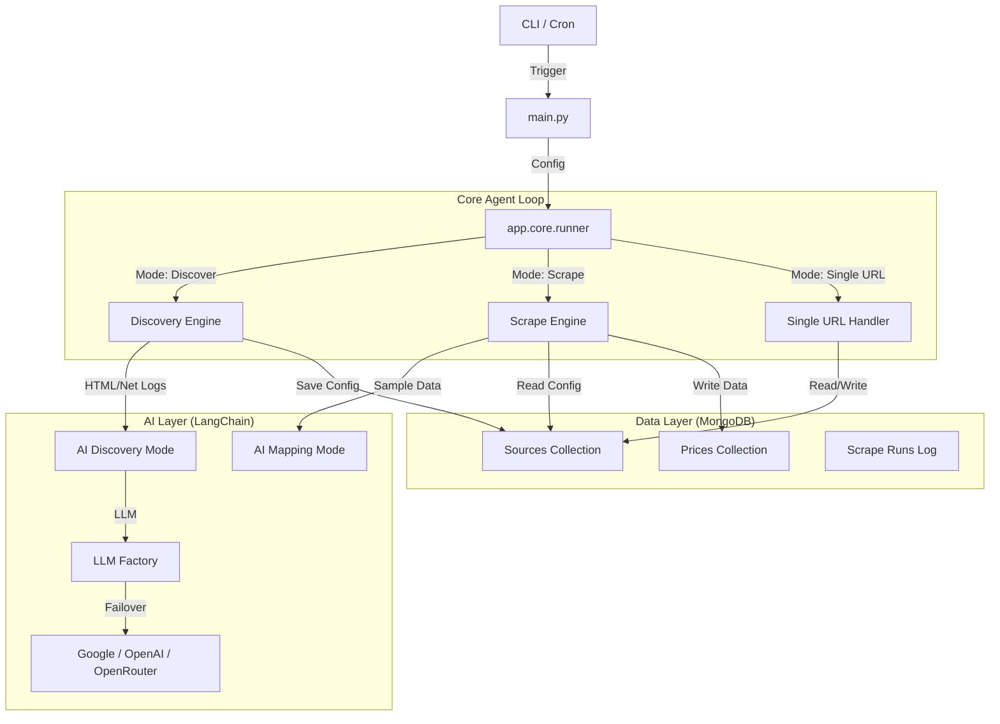

# Mandi AI Agent — Workflow & Architecture

This document serves as the definitive technical guide for the Mandi Scraper Agent. The system is designed to autonomously discover, map, and scrape agricultural market price data from disparate government portals using a resilient, multi-stage pipeline powered by LLMs and asynchronous I/O.

## 1. High-Level Architecture

The agent operates as a modular CLI tool with distinct layers for orchestration, discovery, scraping, and AI analysis.



## 2. Detailed Workflows

### A. Discovery Workflow (`mode="discover"`)
*Goal: Find out HOW to scrape a new website without human coding.*

1.  **Orchestration (`app.discovery.discovery_engine`)**:
    *   Initializes `Playwright` browser (headless).
    *   Navigates to the target URL (`page.goto`).
    *   **Network Sniffing**: Attaches listeners to `request` and `response` events to capture XHR/Fetch calls. Filters for JSON responses > 1KB.
    *   **Heuristic Crawl**: Uses a priority queue (heapq) to visit links.
        *   **L0**: File downloads (PDF/XLS) found in `<a>` tags.
        *   **L1**: "Market", "Rate", "Price" links.
        *   **L2**: General navigation.
    *   **Content Detection**:
        *   `TableDetector`: Finds HTML tables with >3 rows and headers matching keywords (Commodity, Price, Arrival).
        *   `FileDetector`: Identifies downloadable assets.

2.  **AI Analysis (`app.ai.discovery_mode`)**:
    *   Aggregates all findings (API endpoints, table selectors, file URLs) into a compressed JSON context.
    *   **Prompting**: Sends context to the LLM with the `ExtractionConfig` Pydantic schema.
    *   **Decision**: The AI evaluates the reliability of each method:
        *   **API**: Preferred (Score 1.0). Checks for JSON structure.
        *   **HTML Table**: Fallback (Score 0.7). Checks for valid headers.
        *   **File**: Last resort (Score 0.4).
    *   **Validation**:
        *   Normalizes extraction types (`table` → `html_table`).
        *   Rejects hallucinated selectors (e.g., selectors containing raw HTML).

3.  **Persistence**:
    *   Saves the valid `ExtractionConfig` to the `sources` collection.

### B. Mapping Workflow (Implicit in Discovery/First Scrape)
*Goal: Semantic understanding of column names.*

1.  **Sample Scrape**: The runner executes a "dry run" scrape using the newly discovered config to fetch 5 sample records.
2.  **AI Mapping (`app.ai.mapping_mode`)**:
    *   Extracts raw keys from the sample data (e.g., `["Orchard_Name", "Rate_Min", "dt"]`).
    *   Sends these keys to the LLM with the `SchemaMapping` schema.
    *   **Logic**:
        *   Maps raw keys to the unified `Price` schema (`minPrice`, `maxPrice`, `cropName`).
        *   Generates `FieldConversion` rules (e.g., `multiply: 100` for Quintal conversion, date format strings).
3.  **Persistence**:
    *   Updates the source document with `schemaMapping` and `conversions`.

### C. Scrape Workflow (`mode="scrape"`)
*Goal: High-volume production extraction.*

1.  **Load Sources**: Fetches active sources from MongoDB (or CSV in debug mode).
2.  **Dispatch (`app.scraping.scrape_engine`)**:
    *   **API Scraper**:
        *   Uses `httpx.AsyncClient`.
        *   Handles pagination (detects `page` param).
        *   Supports `POST` with JSON or Form data.
    *   **HTML Scraper**:
        *   Fetches page HTML via `httpx`.
        *   Parses with `BeautifulSoup` (lxml) + `pandas.read_html`.
        *   **Robustness**: Wraps HTML in `io.StringIO` to prevent Pandas from misinterpreting large tables as filenames.
    *   **File Scraper**:
        *   Downloads file to temp storage.
        *   Uses `pdfplumber` for PDFs (table extraction) or `openpyxl` for Excel.
3.  **Normalize (`app.scraping.normalizer`)**:
    *   Renames fields using `schemaMapping`.
    *   Executes conversions (math, string cleaning).
    *   Parses dates using `dateutil` and strict format strings.
    *   Validates mandatory fields (`cropName`, `price`, `date`).
4.  **Save (`app.outputs.db_output`)**:
    *   Uses `bulk_write` with `UpdateOne(upsert=True)` to prevent duplicates.
    *   Composite key: `sourceId` + `date` + `cropName` + `mandiName`.

### D. Single URL Workflow (`mode="single_url" --url ...`)
*Goal: One-shot onboarding.*

1.  **Lookup**: Checks DB for `entryUrl`.
2.  **Branch**:
    *   **Found**: Loads config and runs **Scrape Workflow**.
    *   **Not Found**: Runs **Discovery Workflow** → **Mapping Workflow** → **Scrape Workflow** in sequence.

## 3. Configuration & Environment

The agent uses a frozen `AppConfig` dataclass populated by `.env` and CLI args.

| Variable | Description | Default |
|----------|-------------|---------|
| `MONGO_URI` | MongoDB Connection String | — |
| `DB_NAME` | Database Name | `mandi_insights` |
| `LLM_PROVIDER` | `google`, `openai`, `openrouter` | `google` |
| `GOOGLE_API_KEY` | For Gemini models | — |
| `OPENROUTER_API_KEY` | For OpenRouter | — |
| `OPENROUTER_MODEL` | Comma-separated model list for failover | `google/gemini-2.0-flash-001` |
| `HEADLESS` | Run browser without UI | `true` |

## 4. Resilience & Error Handling

### LLM Robustness
*   **Failover Chain**: When using `OPENROUTER`, you can provide a list of models (e.g., `mistral-7b,gemini-2.0,phi-3`). The factory creates a `RunnableWithFallbacks` that automatically retries with the next model upon failure (429, 404, 500).
*   **Structured Output Fallback**: Many free models do not support OpenAI's "JSON Mode" or "Tool Calling". The agent implements a custom parser that:
    1.  Injects a strict JSON schema instruction into the user prompt.
    2.  Uses Regex to strip Markdown fences (` ```json ... ``` `) and "thinking" blocks (`<think>...`).
    3.  Validates the raw string using Pydantic `model_validate_json`.

### Scraping Robustness
*   **HTML Parsing**: `pandas.read_html` can crash on large strings if interpreted as filenames. The agent wraps content in `io.StringIO`.
*   **Hallucination Guard**: Pydantic validators reject AI-generated CSS selectors that contain HTML tags (e.g., `<div...`).
*   **Async/Await**: All network I/O (DB, HTTP, Playwright) is asynchronous to maximize throughput.

### Database Health
*   **Connection Check**: Gracefully degrades to text logging if MongoDB is unreachable.
*   **Health Monitoring**: Tracks consecutive failures. Sources are marked `BROKEN` after 3 failed runs, preventing wasted resources.

## 5. File System Structure

*   **`main.py`**: Entry point & DI container.
*   **`config.py`**: Configuration logic.
*   **`app/core/`**:
    *   `runner.py`: Main control loop.
    *   `context.py`: Request-scoped context (logger, stats).
*   **`app/discovery/`**:
    *   `crawler.py`: Playwright logic.
    *   `network_sniffer.py`: API detection.
*   **`app/scraping/`**:
    *   `scrape_engine.py`: Dispatcher.
    *   `html_scraper.py`, `api_scraper.py`: Implementations.
*   **`app/ai/`**:
    *   `llm.py`: Factory & Failover logic.
    *   `prompts.py`: Prompt templates.
*   **`app/inputs/`**, **`app/outputs/`**: I/O Adapters.

## 6. Usage Examples

**Production Run** (Cron Job)
```bash
# Runs scraping for all active sources in DB
python3 main.py --mode scrape --log mongo
```

**Onboard New Source**
```bash
# Auto-discovers config, maps schema, scrapes data, and saves to DB
python3 main.py --url https://www.apmcnagpur.com/
```

**Debug Mode** (No DB writes)
```bash
# Writes outputs to local CSV/JSON files
python3 main.py --input csv --log txt --url https://example.com
```
