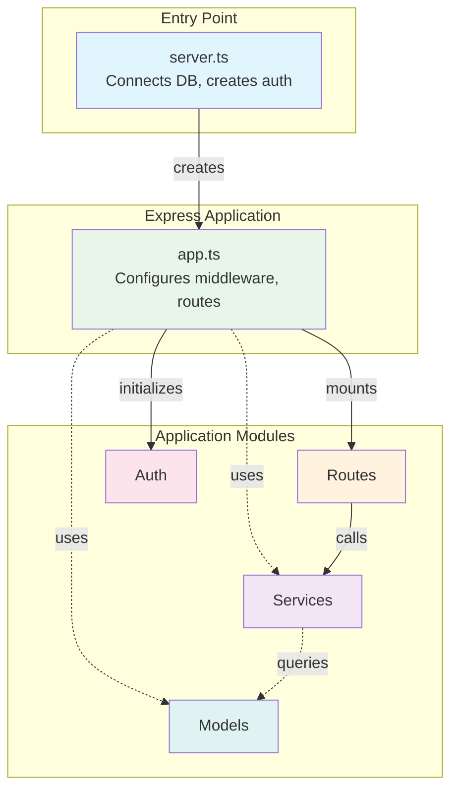
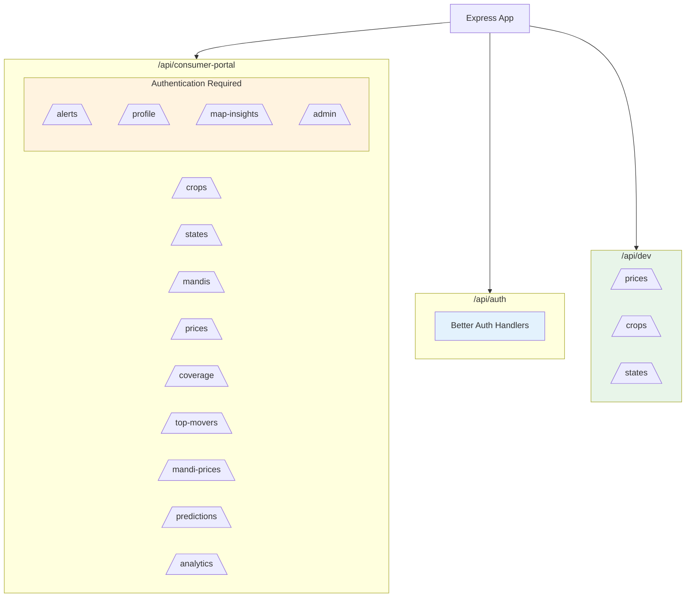
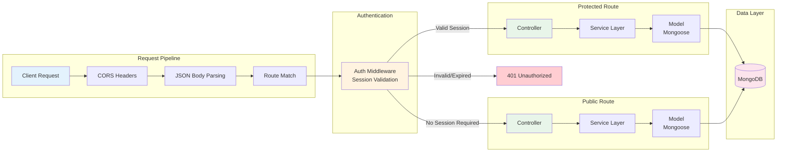
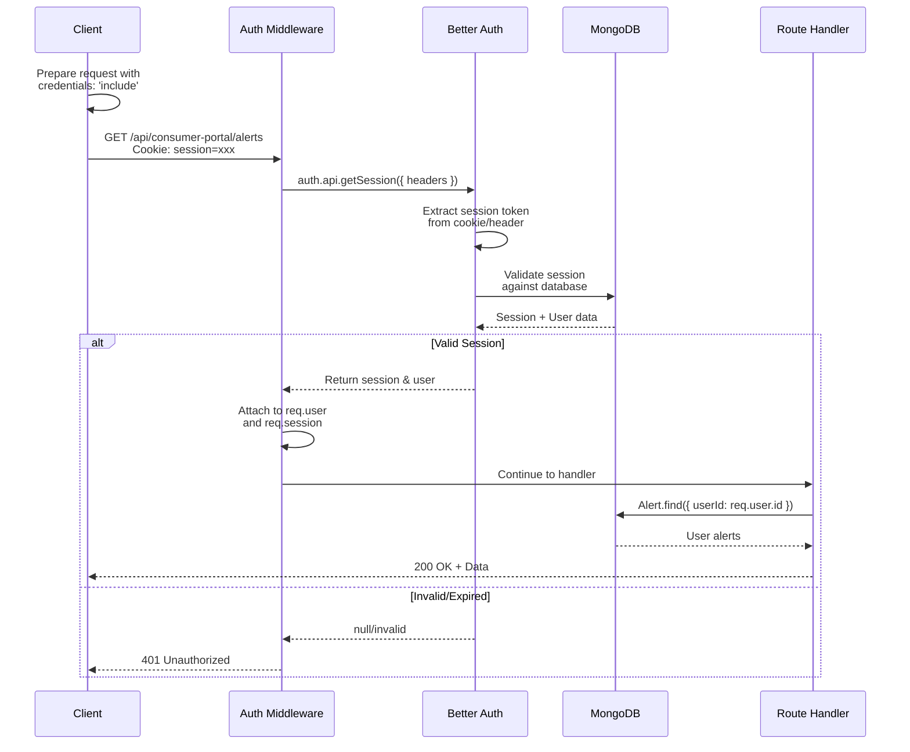
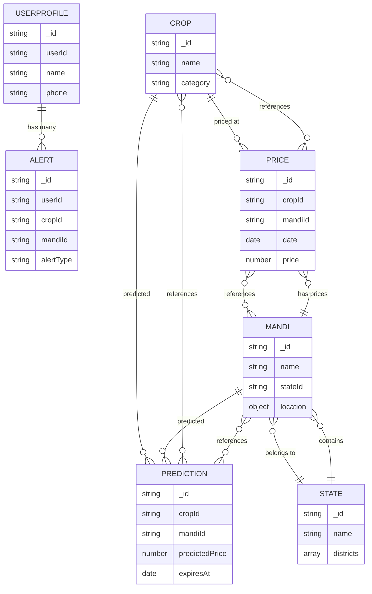

# Server Module Workflow Documentation

This document provides a comprehensive guide to understanding and working with the Ajrasakha server module - a Node.js/Express backend that serves as the central API gateway for the agricultural price intelligence platform.

## Table of Contents

1. [Architecture Overview](#architecture-overview)
2. [Request Lifecycle](#request-lifecycle)
3. [API Endpoints Organization](#api-endpoints-organization)
4. [Cron Jobs & Background Tasks](#cron-jobs--background-tasks)
5. [Database Integration](#database-integration)
6. [Services](#services)
7. [Error Handling & Logging](#error-handling--logging)
8. [Development Workflow](#development-workflow)

---

## Architecture Overview

### Express App Structure

The server follows a modular Express application pattern:



**Key Files:**

| File | Purpose |
|------|---------|
| `src/server.ts` | Application bootstrap - connects to MongoDB, initializes Better Auth, starts HTTP server |
| `src/app.ts` | Express app factory - configures middleware, mounts routes, creates sub-routers |
| `src/routes/index.ts` | Central route exports barrel file |

### Middleware Stack

Request processing flows through this middleware pipeline:

```typescript
// Order of execution (app.ts)
1. cors()              // CORS headers for cross-origin requests
2. express.json()      // Body parsing (applied per-router)
3. auth middleware     // Optional/required authentication
4. route handlers      // Business logic controllers
5. 404 handler         // Catch-all for unmatched routes
```

**Authentication Middleware:**

```typescript
// src/middlewares/auth.middleware.ts
- createAuthMiddleware(auth)    // Requires valid session (401 if missing)
- optionalAuthMiddleware(auth)  // Attaches user if available, continues regardless
```

### Route Organization

Routes are organized by functional domain using Express sub-routers:



---

## Request Lifecycle

### Complete Request Flow



### Authentication Flow with Better Auth



### Service Layer Pattern

All business logic is encapsulated in services, keeping controllers thin:

```mermaid
flowchart TD
    subgraph Controller["Controller Layer"]
        C[Route Handler<br/>routes/alert.routes.ts]
    end

    subgraph Service["Service Layer"]
        S[alertService.createAlert]<br/>Business Logic
        V[validateAlertConfig]<br/>Validation
        R[resolveCrop]<br/>Data Resolution
    end

    subgraph Model["Data Layer"]
        M[Alert.create]<br/>Mongoose Model
        CROP[Crop Lookup]
    end

    subgraph Response["Response"]
        OK[201 Created]
        ERR[400 Bad Request]
    end

    C -->|calls| S
    S -->|validates| V
    S -->|resolves| R
    R -->|queries| CROP
    S -->|creates| M
    M -->|returns| OK
    S -.->|throws| ERR
    ERR -.->|caught by| C

    C -.->|responds| OK

    style Controller fill:#e3f2fd
    style Service fill:#e8f5e9
    style Model fill:#fce4ec
    style OK fill:#c8e6c9
    style ERR fill:#ffcdd2
```

---

## API Endpoints Organization

### Consumer Portal (`/api/consumer-portal/*`)

Public and authenticated endpoints for the consumer-facing application.

| Route | Methods | Auth | Description |
|-------|---------|------|-------------|
| `/crops` | GET | No | List all crops |
| `/crops/:id` | GET | No | Get crop details |
| `/states` | GET | No | List states with districts |
| `/states/:id` | GET | No | Get state details |
| `/mandis` | GET | No | List mandis with filtering |
| `/mandis/:id` | GET | No | Get mandi details |
| `/mandis/nearby` | GET | No | Find mandis near coordinates |
| `/prices` | GET | No | Get price data with filters |
| `/prices/trends` | GET | No | Get price trends for crop/mandi |
| `/prices/history` | GET | No | Historical price data |
| `/prices/latest` | GET | No | Latest prices across mandis |
| `/alerts` | GET, POST | Yes | User alert management |
| `/alerts/:id` | GET, PATCH, DELETE | Yes | Single alert operations |
| `/alerts/:id/toggle` | POST | Yes | Enable/disable alert |
| `/coverage` | GET | No | Coverage statistics |
| `/top-movers` | GET | No | Top gainers/losers |
| `/mandi-prices` | GET | No | Mandi prices for map display |
| `/profile` | GET, PUT | Yes | User profile management |
| `/profile/fcm-token` | POST | Yes | Register FCM token |
| `/predictions/:crop/:mandi` | GET | No | Get price predictions |
| `/analytics/*` | GET | No | Analytics data |
| `/map-insights` | GET, POST | Yes | Saved map views |

### Auth Routes (`/api/auth/*`)

Handled by Better Auth library:

| Endpoint | Method | Description |
|----------|--------|-------------|
| `/api/auth/sign-in` | POST | Email/password or OTP sign in |
| `/api/auth/sign-up` | POST | User registration |
| `/api/auth/sign-out` | POST | End session |
| `/api/auth/session` | GET | Get current session |
| `/api/auth/verify-email` | POST | Verify email with OTP |
| `/api/auth/send-verification-otp` | POST | Send email OTP |
| `/api/auth/magic-link` | POST | Send magic link email |
| `/api/auth/api-key` | * | API key management |

### Dev Routes (`/api/dev/*`)

Developer portal endpoints with API key authentication:

| Route | Auth | Description |
|-------|------|-------------|
| `/api/dev/prices` | API Key | Access price data |
| `/api/dev/crops` | API Key | Crop reference data |
| `/api/dev/states` | API Key | State/district data |

---

## Cron Jobs & Background Tasks

Scheduled tasks run using `node-cron`. **Note:** Currently moved to Python prediction service.

### Job Schedule

```typescript
// src/jobs/cron.ts - Job definitions

┌─────────────────────────────────────────────────────────────────────┐
│  Schedule          │  Job                    │  Description        │
├─────────────────────────────────────────────────────────────────────┤
│  0 1 * * *         │  computeTopMovers       │  Daily at 1 AM IST  │
│  0 2 * * *         │  computeMandiPrices     │  Daily at 2 AM IST  │
│  0 * * * *         │  computeCoverage        │  Every hour         │
│  0 3 * * *         │  cleanupExpiredPredictions  │  Daily cleanup  │
│  0 * * * *         │  processAlerts          │  Every hour         │
└─────────────────────────────────────────────────────────────────────┘
```

### Job Descriptions

#### 1. Top Movers Calculation

```typescript
// Computes daily top gainers and losers by price change
export const computeTopMovers = async () => {
  // 1. Get latest prices
  const latestPrices = await Price.aggregate([
    { $match: { date: { $gte: today } } },
    { $sort: { date: -1 } },
    { $group: { _id: { cropId, mandiId }, ... }}
  ]);
  
  // 2. Get previous day prices
  const previousPrices = await Price.aggregate([...]);
  
  // 3. Calculate change percentages
  const movers = calculateChanges(latestPrices, previousPrices);
  
  // 4. Store top 10 gainers and losers
  await TopMover.deleteMany({});
  await TopMover.insertMany([...topGainers, ...topLosers]);
};
```

#### 2. Mandi Price Aggregation

Aggregates latest prices with mandi location data for map visualization.

#### 3. Coverage Statistics

```typescript
export const computeCoverage = async () => {
  // Calculates:
  - Total APMCs in system
  - APMCs with price data (last 7 days)
  - States covered
  - Coverage percentage
};
```

#### 4. Alert Processing

```typescript
// src/jobs/alert.processor.ts
export const processAlertsJob = async (): Promise<ProcessingStats> => {
  // 1. Fetch all active alerts
  const activeAlerts = await alertService.getAlertsForProcessing();
  
  // 2. Group by crop+mandi for efficient processing
  const groupedAlerts = groupAlertsByCropMandi(activeAlerts);
  
  // 3. For each group:
  for (const group of groupedAlerts) {
    //    a. Get latest price
    //    b. Check price alerts
    //    c. Get price history
    //    d. Check trend alerts
    //    e. Send notifications for triggered alerts
  }
};
```

### Alert Triggering Logic

```
Price Alert Check:
  IF direction = 'above' AND currentPrice >= thresholdPrice → TRIGGER
  IF direction = 'below' AND currentPrice <= thresholdPrice → TRIGGER

Trend Alert Check:
  oldPrice = price from (now - days) days ago
  changePct = ((latestPrice - oldPrice) / oldPrice) * 100
  IF trendDirection = 'increase' AND changePct >= percentage → TRIGGER
  IF trendDirection = 'decrease' AND changePct <= -percentage → TRIGGER
```

---

## Database Integration

### MongoDB Connection

```typescript
// src/config/db.ts
import mongoose from 'mongoose';

const connectDB = async () => {
  const conn = await mongoose.connect(env.MONGO_URI);
  console.log(`MongoDB Connected: ${conn.connection.host}`);
};
```

### Mongoose Models

All models defined in `src/models/index.ts`:

| Model | Collection | Purpose |
|-------|------------|---------|
| `Crop` | crops | Agricultural commodities |
| `State` | states | Indian states with districts |
| `Mandi` | mandis | APMC markets with geo-coordinates |
| `Price` | prices | Historical price records |
| `UserProfile` | userprofiles | Extended user data |
| `Alert` | alerts | User price/trend alerts |
| `TopMover` | topmovers | Cached daily price movers |
| `Coverage` | coverage | System coverage stats (singleton) |
| `PriceTrend` | pricetrends | Cached trend calculations |
| `MandiPrice` | mandiprices | Mandi prices with location |
| `Prediction` | predictions | ML price predictions |
| `MapInsight` | mapinsights | User saved map views |

### Key Indexes

```typescript
// Price indexes for query optimization
priceSchema.index({ date: -1 });
priceSchema.index({ mandiId: 1, cropId: 1, date: -1 });
priceSchema.index({ stateId: 1, cropId: 1, date: -1 });

// Compound unique index prevents duplicate entries
priceSchema.index(
  { source: 1, date: 1, cropId: 1, mandiId: 1 },
  { unique: true }
);

// Geospatial index for nearby queries
mandiSchema.index({ location: '2dsphere' });
```

### Data Relationships



---

## Services

### Prediction Service

Proxies to Python ML prediction engine with caching:

```typescript
// src/services/prediction.service.ts

// Cache-first retrieval
export const getPrediction = async (cropId, mandiId) => {
  // 1. Check for valid cached prediction
  const cached = await Prediction.findOne({ cropId, mandiId, expiresAt: { $gt: new Date() } });
  if (cached) return cached;
  
  // 2. Generate new prediction via Python service
  const response = await axios.post(
    `${PREDICTION_ENGINE_URL}/predictions/${cropId}/${mandiId}`,
    {},
    { timeout: 30000 }
  );
  
  // 3. Store and return
  await Prediction.create({ ...response.data });
  return response.data;
};
```

**Python Service Integration:**
- URL configured via `PREDICTION_ENGINE_URL` env var
- Health check at `/api/health` endpoint
- Timeout: 30 seconds for prediction generation
- Cache expiry: 24 hours

### Alert Service

Manages user alerts and processing logic:

```typescript
// Key functions:
- createAlert(data)           // Create new alert with validation
- getUserAlerts(userId)       // Get user's alerts
- processPriceAlerts(price)   // Check price conditions
- processTrendAlerts(history) // Check trend conditions
- markAlertTriggered(id)      // Update alert state
```

### Firebase Service

Handles push notifications:

```typescript
// src/services/firebase.service.ts

// FCM Token Management
- registerFCMToken(userId, token)   // Store device token
- getUserFCMTokens(userId)          // Get active tokens
- removeInvalidToken(userId, token) // Cleanup invalid tokens

// Notifications
- sendPriceAlertNotification(userId, alert, priceData)
- sendTrendAlertNotification(userId, alert, trendData)
- sendPushNotification(tokens, title, body, data)
```

### Price Aggregation Service

```typescript
// src/services/price.service.ts
- getPrices(filters)         // Filtered price queries
- getPriceTrends(crop, mandi, days)  // Historical trends
- getLatestPrices(filters)   // Most recent prices
- getPriceStats(crop, mandi) // Aggregated statistics
```

---

## Error Handling & Logging

### Global Error Pattern

```typescript
// Controller-level error handling
router.get('/:id', async (req, res) => {
  try {
    const data = await service.getById(req.params.id);
    if (!data) {
      return res.status(404).json({ error: 'Not found' });
    }
    res.json(data);
  } catch (error) {
    console.error('[Route Error]', error);
    res.status(500).json({ error: 'Internal server error' });
  }
});
```

### Logging Conventions

```typescript
// Error logging
console.error('[ServiceName] Error message:', error);

// Job logging
console.log('[Cron] Job started');
console.log('[Cron] Job completed:', results);

// Processor logging
console.log('[AlertProcessor] Processing N alerts');
```

### Environment Validation

Uses Zod for strict env validation at startup:

```typescript
// src/config/env.ts
const envSchema = z.object({
  PORT: z.coerce.number().default(5000),
  MONGO_URI: z.url(),
  BETTER_AUTH_SECRET: z.string().min(32),
  // ... all required env vars
});

// Exits process on validation failure with clear error messages
```

---

## Development Workflow

### Adding New Routes

1. **Create controller** (`src/controllers/myFeature.controller.ts`):

```typescript
export const getMyFeature = async (req: Request, res: Response) => {
  try {
    const data = await myFeatureService.getData(req.query);
    res.json(data);
  } catch (error) {
    res.status(500).json({ error: (error as Error).message });
  }
};
```

2. **Create service** (`src/services/myFeature.service.ts`):

```typescript
export const getData = async (filters: any) => {
  return Model.find(filters).lean();
};
```

3. **Create route** (`src/routes/myFeature.routes.ts`):

```typescript
import { Router } from 'express';
import { getMyFeature } from '../controllers/myFeature.controller';

const router = Router();
router.get('/', getMyFeature);
export default router;
```

4. **Register in index** (`src/routes/index.ts`):

```typescript
export { default as myFeatureRoutes } from './myFeature.routes';
```

5. **Mount in app** (`src/app.ts`):

```typescript
import { myFeatureRoutes } from './routes';
router.use('/my-feature', myFeatureRoutes);
```

### Adding New Models

1. **Define schema** in `src/models/index.ts`:

```typescript
const myModelSchema = new mongoose.Schema({
  _id: { type: String, required: true },
  name: { type: String, required: true },
  // ... fields
}, {
  timestamps: true,
  collection: 'mymodels'
});

// Add indexes
myModelSchema.index({ name: 1 });

export const MyModel = mongoose.model('MyModel', myModelSchema);
```

2. **Export interface** for TypeScript:

```typescript
export interface IMyModel {
  _id: string;
  name: string;
  createdAt: Date;
  updatedAt: Date;
}
```

### Testing Approach

Currently minimal test coverage. Recommended pattern:

```typescript
// tests/myFeature.test.ts
import request from 'supertest';
import createApp from '../src/app';

describe('MyFeature Routes', () => {
  const app = createApp(mockAuth);

  test('GET /api/consumer-portal/my-feature', async () => {
    const res = await request(app).get('/api/consumer-portal/my-feature');
    expect(res.status).toBe(200);
    expect(res.body).toHaveProperty('data');
  });
});
```

### Running the Server

```bash
# Development (with hot reload)
bun run dev

# Build
bun run build

# Production
bun run start
```

### Environment Setup

Required environment variables (see `src/config/env.ts`):

```bash
# Server
PORT=5000
MONGO_URI=mongodb+srv://...
BETTER_AUTH_SECRET=<32+ char secret>
BETTER_AUTH_URL=http://localhost:5000
BETTER_AUTH_TRUSTED_ORIGINS=http://localhost:5173,http://localhost:3000

# Services
PREDICTION_ENGINE_URL=http://localhost:8000

# Email (for OTP/magic link)
SMTP_HOST=smtp.gmail.com
SMTP_PORT=465
SMTP_USER=your@email.com
SMTP_PASS=your-app-password
EMAIL_FROM=noreply@example.com
```

---

## Additional Notes

### Security Considerations

- All auth routes use secure session cookies
- CORS restricts origins to configured whitelist
- No sensitive data logged to console

### Performance Optimizations

- Database indexes on frequently queried fields
- Cached collections (TopMover, Coverage, MandiPrice) reduce aggregation load
- Prediction caching reduces ML service calls
- Alert grouping minimizes price queries

### Scaling Considerations

- Stateless design allows horizontal scaling
- Session storage in MongoDB (via Better Auth)
- Background jobs should move to queue (Redis/Bull) for production scale
- Consider read replicas for heavy analytics queries
